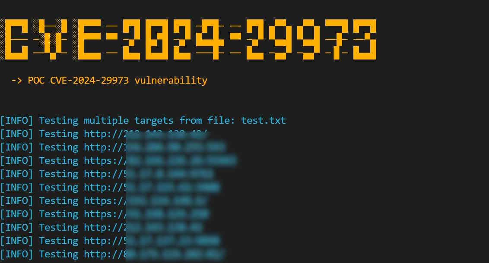

# CVE-2024-29973 PoC and Bulk Scanner

## Overview

This is a proof-of-concept (PoC) and bulk scanner for CVE-2024-29973: Command injection vulnerability in Zyxel NAS326 firmware versions before V5.21(AAZF.17)C0 and NAS542 firmware versions before V5.21(ABAG.14).

### Version 1.0.2
    - Fixed the payload mechanism. Thanks to https://github.com/p0et08/ for mentioning this.




## How to Use

### Single Target Scan

To scan a single target:
```sh
python cve-2024-29973.py -u target
```

### Bulk Target Scan
To mass scan bulk targets IPs:
```sh
python cve-2024-29973.py -f targets.txt
```

## Installation

### Minimum Requirements

- Python 3.6 or higher
- `requests` library

### Installing The Script

```sh
git clone https://github.com/bigb0x/CVE-2024-29973.git; cd CVE-2024-29973
```

### Installing Required Packages

Install the required packages using pip:

```sh
pip install requests
```

## Author

POC was created by [M Ali](https://x.com/MohamedNab1l).

## License

This project is licensed under the MIT License.

## Disclaimer

This provided tool is for educational purposes only. I do not encourage, condone, or support unauthorized access to any system or network. Use this tool responsibly and only on systems you have explicit permission to test. Any actions and consequences resulting from misuse of this tool are your own responsibility.

## References
- https://cve.mitre.org/cgi-bin/cvename.cgi?name=CVE-2024-29973
- https://outpost24.com/blog/zyxel-nas-critical-vulnerabilities/
